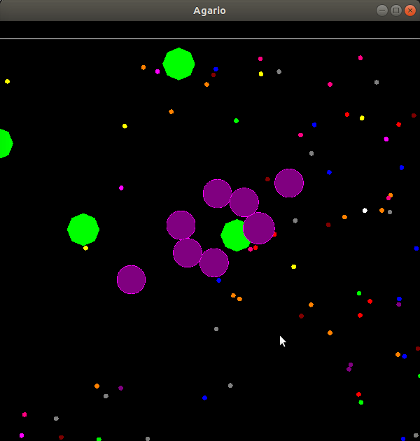

# Agar.io engine


This is my standalone, simple implementation of game engine for [Agar.io](https://agar.io/) with simple graphical interface.
I use this engine as submodule in my implementation of C++ game server (you can find it [here](https://github.com/dziulek/AgarioServer).


# Setup
You have to clone repository with all submodules (with `--recurse-submodules` option) and install [SFML](https://www.sfml-dev.org/download.php).
To build and run:
```
$ mkdir build
$ cd build/
$ cmake ..
$ make
$ ./src/AgarioEngineDemo_run
```

